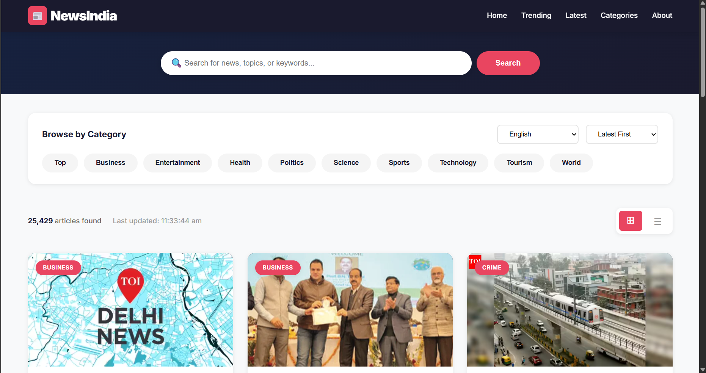

# 📰 NewsIndia - Real-Time Indian News Aggregator


> A professional, fully responsive news aggregator website delivering real-time news from across India. Built with vanilla JavaScript, HTML5, and CSS3.

## 🌟 Features

### Core Functionality
- **🔴 Real-Time News**: Live news updates from across India using GNews API
- **🔍 Advanced Search**: Smart search functionality with keyword filtering
- **📱 Fully Responsive**: Seamless experience on mobile, tablet, and desktop devices
- **🌐 Multi-Language Support**: English, Hindi, Bengali, Telugu, Marathi, Tamil, Malayalam
- **📂 Category Filtering**: 9 news categories (General, World, Nation, Business, Technology, Entertainment, Sports, Science, Health)
- **⚡ Dual View Modes**: Switch between Grid and List view layouts
- **🎨 Modern UI/UX**: Professional design with smooth animations and transitions

### Technical Features
- **Zero Dependencies**: Pure vanilla JavaScript - no frameworks required
- **Fast Loading**: Optimized performance with minimal load times
- **SEO Friendly**: Semantic HTML5 structure
- **Cross-Browser Compatible**: Works on all modern browsers
- **Smooth Scrolling**: Enhanced user experience with fluid animations
- **Error Handling**: Graceful error messages and retry mechanisms

## 🚀 Live Demo

[**View Live Demo**](#) <!-- Add your live demo link here -->

## 📸 Screenshots

### Desktop View


### Mobile View


## 🛠️ Installation & Setup

### Prerequisites
- A modern web browser (Chrome, Firefox, Safari, Edge)
- A GNews API key ([Get it here](https://gnews.io/))
- A code editor (VS Code, Sublime Text, etc.)

### Step 1: Clone the Repository
```bash
git clone https://github.com/yourusername/newsindia.git
cd newsindia
```

### Step 2: Get Your API Key
1. Visit [GNews.io](https://gnews.io/)
2. Sign up for a free account
3. Navigate to your dashboard
4. Copy your API key

### Step 3: Configure API Key
Open `index.html` and locate the following line (around line 651):

```javascript
const CONFIG = {
    API_KEY: 'YOUR_GNEWS_API_KEY_HERE', // Replace with your actual API key
    API_URL: 'https://gnews.io/api/v4',
    CATEGORIES: ['general', 'world', 'nation', 'business', 'technology', 'entertainment', 'sports', 'science', 'health']
};
```

Replace `YOUR_GNEWS_API_KEY_HERE` with your actual GNews API key.

### Step 4: Launch the Website
Simply open `index.html` in your web browser:

```bash
# On macOS
open index.html

# On Linux
xdg-open index.html

# On Windows
start index.html
```

Or use a local server (recommended):

```bash
# Using Python 3
python -m http.server 8000

# Using Node.js (http-server)
npx http-server

# Using PHP
php -S localhost:8000
```

Then visit `http://localhost:8000` in your browser.

## 📁 Project Structure

```
newsindia/
│
├── index.html          # Main HTML file (complete standalone application)
├── README.md           # Project documentation
├── screenshots/        # Screenshots for documentation
│   ├── desktop.png
│   ├── mobile.png
│   └── list-view.png
└── LICENSE            # License file
```

## 🎯 Usage Guide

### Browsing News
1. **Home Page**: View latest headlines from India
2. **Categories**: Click on category chips to filter news by topic
3. **Search**: Enter keywords in the search bar to find specific news
4. **Language**: Select your preferred language from the dropdown
5. **View Toggle**: Switch between Grid and List view using the toggle buttons

### Keyboard Shortcuts
- `Enter`: Submit search query
- `Scroll`: Smooth scrolling throughout the page

### Mobile Usage
- Tap the hamburger menu (☰) to access navigation
- Swipe through news cards
- All features fully functional on touch devices

## 🔧 Configuration

### Customizing Categories
Edit the `CATEGORIES` array in the JavaScript section:

```javascript
CATEGORIES: ['general', 'world', 'nation', 'business', 'technology', 'entertainment', 'sports', 'science', 'health']
```

### Changing Colors
Modify CSS custom properties in the `:root` selector:

```css
:root {
    --primary-color: #1a1a2e;
    --secondary-color: #16213e;
    --highlight-color: #e94560;
    /* Add your custom colors */
}
```

### Adjusting Results Limit
Change the `maxResults` in the state object:

```javascript
const state = {
    maxResults: 10, // Change this value (max: 100 for GNews free tier)
    // ...
};
```

## 🌐 API Integration

### GNews API Endpoints Used

#### Top Headlines
```javascript
GET https://gnews.io/api/v4/top-headlines?apikey=YOUR_KEY&country=in
```

#### Search News
```javascript
GET https://gnews.io/api/v4/search?apikey=YOUR_KEY&q=query&country=in
```

#### Category Filter
```javascript
GET https://gnews.io/api/v4/top-headlines?apikey=YOUR_KEY&country=in&category=technology
```

### API Rate Limits (Free Tier)
- **Requests**: 100 requests per day
- **Articles**: 10 articles per request (max: 100)
- **Languages**: 60+ languages supported

## 📱 Responsive Breakpoints

```css
/* Desktop: Default styles */
/* Tablet: max-width: 1024px */
/* Mobile: max-width: 768px */
/* Small Mobile: max-width: 480px */
```

## 🎨 Design Highlights

- **Professional Color Scheme**: Dark navy blue with vibrant red accents
- **Typography**: Inter font family for modern, clean aesthetics
- **Animations**: Smooth transitions and hover effects
- **Shadows**: Layered shadow system for depth
- **Cards**: Elevated card design with hover states
- **Icons**: Unicode emoji icons for universal compatibility

## 🔒 Security Best Practices

⚠️ **Important Security Note**: Never commit your API key to public repositories!

### Recommended Approach:
1. Create a `.env` file (add to `.gitignore`)
2. Store API key in environment variables
3. Use a backend proxy to secure API calls
4. Implement rate limiting

### For Production:
```javascript
// Use environment variables
const API_KEY = process.env.GNEWS_API_KEY;

// Or use a backend proxy
fetch('/api/news') // Your backend handles API key
```

## 🐛 Troubleshooting

### News Not Loading
- ✅ Check if API key is correctly configured
- ✅ Verify internet connection
- ✅ Check browser console for errors
- ✅ Ensure API rate limit not exceeded

### Images Not Displaying
- ✅ Check image URLs in API response
- ✅ Verify CORS settings
- ✅ Fallback placeholder should load automatically

### Search Not Working
- ✅ Ensure search query is not empty
- ✅ Check API response in network tab
- ✅ Verify country filter is set to 'in'

## 🚀 Performance Optimization

- **Lazy Loading**: Images load as they enter viewport (ready for implementation)
- **Debouncing**: Search queries are debounced (ready for implementation)
- **Caching**: Browser caches static assets
- **Minification**: Consider minifying CSS/JS for production
- **CDN**: Use CDN for fonts and assets

## 🔮 Future Enhancements

- [ ] Dark/Light mode toggle
- [ ] Bookmark favorite articles
- [ ] Share articles on social media
- [ ] Save articles for offline reading
- [ ] Push notifications for breaking news
- [ ] Advanced filters (date range, source)
- [ ] Trending topics widget
- [ ] User authentication
- [ ] Personalized news feed
- [ ] Article summary using AI

## 🤝 Contributing

Contributions are welcome! Please follow these steps:

1. Fork the repository
2. Create a new branch (`git checkout -b feature/amazing-feature`)
3. Commit your changes (`git commit -m 'Add amazing feature'`)
4. Push to the branch (`git push origin feature/amazing-feature`)
5. Open a Pull Request

### Contribution Guidelines
- Follow existing code style
- Write clean, commented code
- Test on multiple browsers
- Update documentation as needed

## 📝 License

This project is licensed under the MIT License - see the [LICENSE](LICENSE) file for details.

## 👨‍💻 Author

**Your Name**
- GitHub: [@vikashkumarsingh21](https://github.com/vikashkumarsingh21)
- LinkedIn: [vikas kumar](https://www.linkedin.com/in/vikas-kumar-0803r/)
- Email: vk0102103@gmail.com

## 🙏 Acknowledgments

- [GNews API](https://gnews.io/) - For providing excellent news API
- [Google Fonts](https://fonts.google.com/) - For the Inter font family
- [Shields.io](https://shields.io/) - For beautiful badges
- Community contributors and supporters

## 📊 Project Stats


## 📞 Support

If you encounter any issues or have questions:

1. Check the [Troubleshooting](#-troubleshooting) section
2. Search [existing issues](https://github.com/vikashkumarsingh21/newsindia/issues)
3. Create a [new issue](https://github.com/vikashkumarsingh21/newsindia/issues/new)
4. Contact via email

## ⭐ Show Your Support

Give a ⭐️ if you like this project!

---

<div align="center">

**Made with ❤️ for the Indian News Community**

[Report Bug](https://github.com/vikashkumarsingh21/newsindia/issues) · [Request Feature](https://github.com/vikashkumarsingh21e/newsindia/issues) · [Documentation](https://github.com/vikashkumarsingh21/newsindia/wiki)

</div>